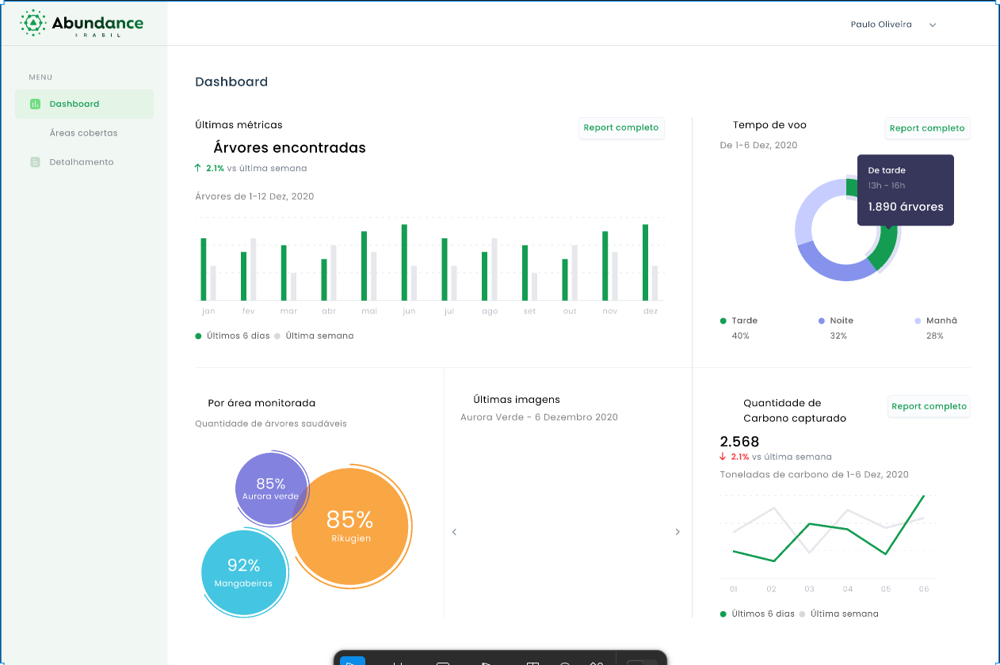
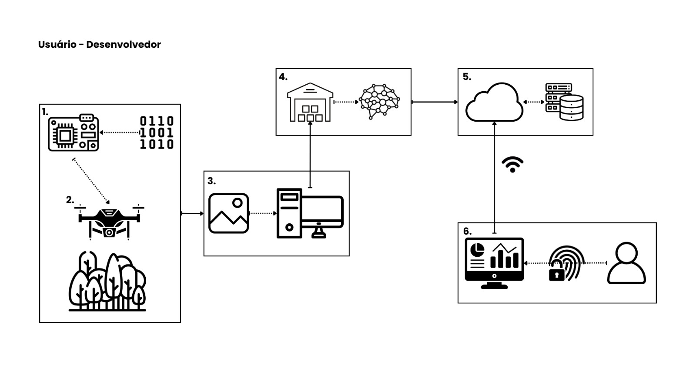
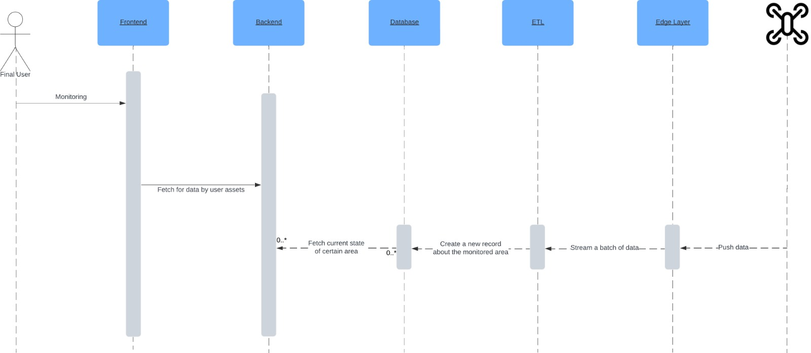

# Condições de implementação: Protótipos e Guias de Utilização

Durante o desenvolvimento do projeto, foi projetada uma arquitura de solução que fosse condizente com as condições de implementação da ideia proposta. Como o foco do projeto não está na implementação de um frontend complexo, mas sim na implementação de uma arquitetura robusta e escalável, utilizamos os **princípios de design de interação** para refletir nas **condições de implementação** que elucidassem a melhor compreensão do usuário final de forma a facilitar a interação entre homem e máquina.

Para isso, precisamos ter uma noção clara das condições de implementação do projeto, que incluem a checagem do status atual do projeto (capacidade técnica, restrições de hardware, padrões e guidelines, performance e tempo de resposta, condições de rede, segurança e privacidade, etc.), para fazer o planejamento efetivo, definição e priorização de tarefas que atendam os requisitos, definição de prazos e status que permitam indicar as condições de implementação realistas.

Pensando nisso, focamos nos princípios de Visibilidade e aprendizado facilitado para traduzir ideias e conceitos de forma clara e objetiva, de modo que o usuário possa compreender o funcionamento da aplicação de forma intuitiva.

## Protótipos

Como a visualização dos dados é um dos principais pontos para a compreensão do usuário, criamos protótipos de telas que representam a interação do usuário com a aplicação. Para isso, utilizamos a ferramenta Figma para a criação dos protótipos. Apesar disso, o foco principal do projeto é a implementação da arquitetura de solução, e não a criação de um frontend complexo.

Para facilitar o olhar mais holístico da aplicação, utilizamos a estrutura de Reference Model of Open Distributed Processing (RM-ODP) para a criação de diagramas simplificados que explicam o sistema macro como um todo.

As legendas abaixo referem-se a cada parte do diagrama:

1. Utilizamos microprocessadores como estrutura acoplada ao drone para realizar a captura de fotos. Esses componentes são adicionados ao drone que sobrevoará a floresta.
2. Captura e envio de imagens para uma camada de processamento em borda - perto do local - onde as imagens serão recebidas e posteriormente endereçadas para o modelo de visão computacional.
3. Recebimento e encaminhamento das imagens.
4. Armazenamento e execução do modelo de visão computacional para gerar os resultados de contagem e outros status relevantes.
5. Armazenamento desses resultados em nuvem.
6. Consumo dessas informações pelo usuário utilizando ferramentas de visualização simplificadas.

## Fluxo da aplicação

Preparamos um fluxo da aplicação para que haja o entendimento completo dos processos que ocorrem na aplicação. Para isso, utilizamos o Figma para a criação dos protótipos:

